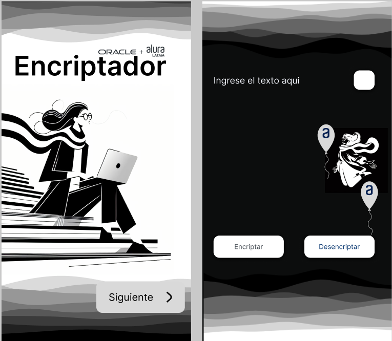

 <h1 align="center">chanllenge-Alura-Oracle</h1>
 
<i>Proyecto que pone en practica lo aprendido en le primer modulo de <strong> Oracle next Education</strong></i>

>Challenge ONE - Principiante en programación

## Información general 
 - [¿Qué es un challenge de alura?](https://www.aluracursos.com/challenges?host=https://app.aluracursos.com)
 - [Más sobre Challenge Alura 1 ](https://www.aluracursos.com/challenges/oracle-one/sprint01-construye-un-encriptador-texto-con-javascript)

## ¿Qué he aprendido?

 Buenas practicas 
 ## website
link : https://remr11.github.io/chanllenge-Alura-Oracle/ 
<a href="https://remr11.github.io/chanllenge-Alura-Oracle/"><a>

## Author

- [@REMR11](https://github.com/REMR11)

## Feedback

¿Quieres darme feedback?, por favor contactamen remr11@outlook.com
